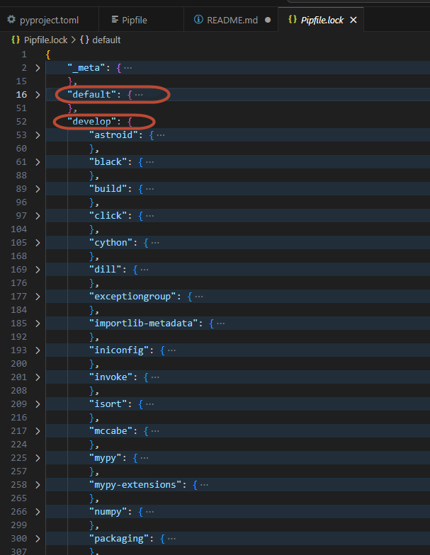
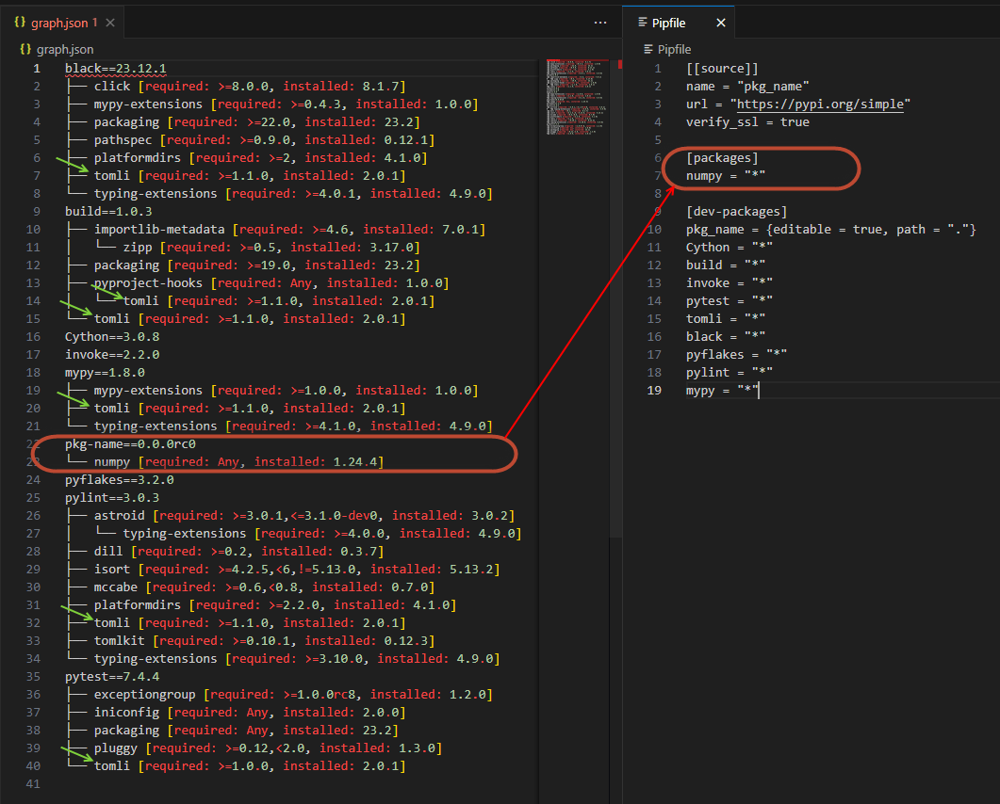
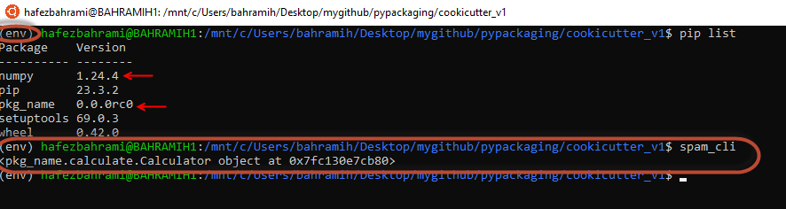
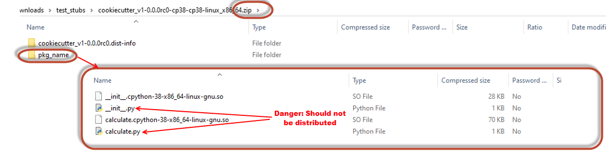

# Build Sysytem Table
We will be using pyproject.toml to specify the build system in a table formatted in a *.toml file. The build-front-end (e.g. build or pip) tuses build-backend (such as setuptools, setuptools-scm, wheel, ...) to build the package.


## 1 Working on local Dev Environment:
We should be able to differentiate the local environemnt we want to create as a developer to use all sort of dev tools (such Back, Mypy, Lint, ...) that user should not be aware of it. Here in this silly package, user only needs to install Numpy package, and the rest should stay in dev environment.

This section is about how to build and keep this local/dev environemnt. Later, we will use this environment, to build the wheel file to be sent to the user (in other word that wheel file should only have the Numpy dependency in our silly package).

### 1.1 create setup.py, task.py, and pyproject.toml
All stuff that we used to put in the setup.py (through the setup() call), which required setup.cfg, now are dumped simply into
the pyproject.toml file. It is easier, cleaner, and less confusing.

Just a note, tht Pipfile format is also a *.toml format

### 1.2 Create a Pipfile
- (I) Look at the Pipfile for 3 different section of it: Source, Packages, and Dev-Packages 
- (II) Creating the Pipfile.lock: The lock file tries to create a comprehensive list of packages that can be installed in a virtual environment. For instance, considering the list of 11 3rd part libraries listed in our pipfile, what version of each of them can be constsent with the rest to install. It is kind of created a dependency-graph. Thus, pipfile.lock is nothing but a list of "what package and what version of it to be installed in: (a) the *whl package itself, when deployed to the user, and (b) all packages to be installed in the developer virtual env for development. Obviously, (a) is a subset of (b)



### 1.3 Create a local virtual env
- Now, we couuld create a local virtual env, and try to install all the packages in the "dev-packages" section of the pipfile.lock file
- ```pipenv shell``` will create a shell (virtual env), in "~/.local/share/virtualenvs/Name_of_Venv_XXXX". This will only have 3 native python packages (setuptools, wheel, pip), otherwise it is like an empty env.
- ```pipenv sync --dev```: this will synv and install all the packages we have in "dev-packages" section of a pipfile.lock.
- ```pipenv grapg > dep_graph.json```: This will look at the installedpackages inside our virtual env, and will create a graph that shows all the dependencies between all the packages noted in the pipfile (more importantly with the version # in the pipfile.lock).

There are a couple of points in the screen-shot below for what we got from ```pipenv graph > dep_graph.json```:
- (I) All the packages noted in the pipfile (and with the version # in pipfile.lock) can be found here.
- (II) Look at the numpy as the only "package" to be shipped to the user (requires user machine to install it). It is under the package_name whell-file name.
- (III) Dependencies, such as toml package, in this screen shot emphasizes the importance of dependency-conflict-resolution by the pipfile.lock file, on what version of each package is consostent with all other (if needed).
- (IV) Also, note that a lot more than what we specified in our Pipfile will be installed in our env, due to dependency packages.




## 2 Build the final wheel file:
We will use the dev local-environment we built in section 1 above, using pipfile, to run our Build front end. 

Python job requiring a build should start with the absolute minimum requirements:
- pip
- wheel
- setuptools (build backend)
- build (build front end)
- invoke (tasks.py)

Previously, we used to call the setup.py directly to build a distributable package (bdist_wheel), as:
```python setup.py bdist_wheel```

Here, we use "build" package as our build-front end to do the same and to build a distributable package (bdist_wheel), as:
```python -m build . --wheel```
THat is what we put in the invoke-build call in the task.py.


### 2.1 Dependencies in pyproject.toml
Pay special attention on dependencies specified in pyproject.toml. It must only include those packages that gets installed in user's machine alongside the main pacage (here, pkg_name). Below, we added torh as optional dependencies.  

```
dependencies = ["numpy",]

[project.optional-dependencies]
TORCH = ["torch",]
```
### 2.2 Adding CLI (Command Line Interface)
In pyproject.toml, we can add a cli, as below:

```
[project.scripts]
spam_cli = "pkg_name.calculate:Calculator"
```
Now, if in a new env, we inistall our pkg_name package, we can call "spam_cli" in command line, and this will create an object of "Claculator" class.



We could use "click" library and include them in our distributed-package to the user, and use click decorators to pass some commands to our Calculator onject. This way, we could get more meaningful functionality in our distributedd package.

### 2.3 Cythonize vs Not-Chythonized wheel package
Currently we add the "Cython" as an essential package for build-process, in our pyproject.toml:
```
[build-system]
requires = ["setuptools", "wheel", "Cython", "setuptools-scm",]
build-backend = "setuptools.build_meta"
```


### 2.4 stubs
stubs are files containing only type information, empty of runtime code (the filename ends in *.pyi). Historically, "function stub" is an incomplete function and a placeholder for a function that you want to finish the functionality/logic of it later.


### 2.4 what is in the final created wheel file
It is always important to check what we have in our final (to be distributed) wheel file. To check this, simple change .whl extention to .zip, and then open up the folder. Inside the pkg_name folder, you will see what is packaged into the zip file (into the sheel file). If not careful, like the one I showed in the screet-shot below, we might have included all our source file, along with the *.so file. A safe packaging should only include *.so file.


To prevent the source files (*.py) into the wheel file, we can add the following command into setu() call, in setup.py.

```
setup(
    .
    .
    cmdclass={"build_py": build_py},
)
```

## References
- pythons docs on pyproject.toml https://packaging.python.org/en/latest/guides/writing-pyproject-toml/
- setuptools: https://setuptools.pypa.io/en/latest/userguide/pyproject_config.html
- and as an example here is blacks config docs https://black.readthedocs.io/en/stable/usage_and_configuration/the_basics.html#configuration-via-a-file